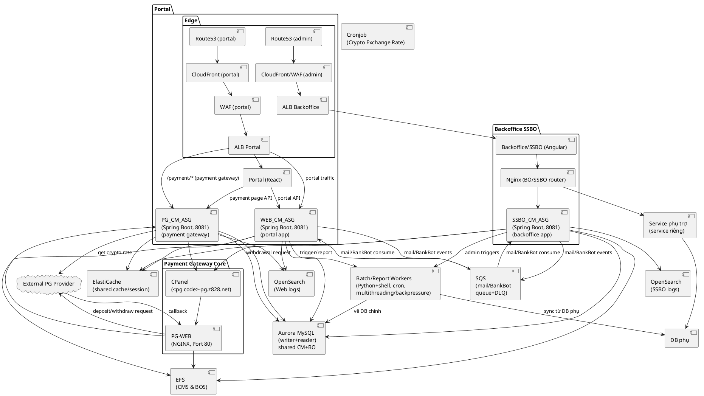

## Giới thiệu về Project

**CashMarket** là một hệ thống fintech quy mô lớn, được thiết kế để xử lý các giao dịch thanh toán và quản lý ví điện tử (wallet) với khả năng chịu tải cao và đảm bảo tính nhất quán dữ liệu. Hệ thống phục vụ hai đối tượng người dùng chính:

- **Portal (User-facing)**: Nền tảng cho end-users thực hiện các giao dịch deposit (nạp tiền) và withdrawal (rút tiền) thông qua Payment Gateway tích hợp với các nhà cung cấp thanh toán bên ngoài. Portal xử lý traffic lớn với yêu cầu performance cao và khả năng scale linh hoạt.

- **Backoffice/SSBO (Admin)**: Hệ thống quản trị nội bộ cho phép admin quản lý members, transactions, content, settings, và phê duyệt các giao dịch withdrawal. Backoffice yêu cầu bảo mật cao, tích hợp với nhiều hệ thống con, và có các tính năng báo cáo, phân tích phức tạp.

**Thách thức kỹ thuật chính:**
- Xử lý high concurrency cho payment transactions với đảm bảo idempotency và strong consistency cho wallet balance updates
- Tách biệt và scale độc lập giữa Portal (high traffic) và Backoffice (high security) 
- Xử lý payment callbacks từ External Payment Gateway Providers với đảm bảo reliability và reconciliation
- Batch processing cho reports và ETL jobs với khối lượng dữ liệu lớn
- Đảm bảo high availability và disaster recovery cho hệ thống tài chính

**Tech Stack chính:**
- **Backend**: Java Spring Boot (monolith phân tầng), Python (batch jobs)
- **Frontend**: React (Portal), Angular (Backoffice)
- **Database**: Aurora MySQL (multi-AZ, writer-reader architecture)
- **Caching**: ElastiCache (Redis)
- **Infrastructure**: AWS (EC2, ASG, ALB, CloudFront, WAF, SQS, EFS, OpenSearch)
- **CI/CD**: GitHub Actions / AWS CodePipeline với Terraform/CloudFormation

---

### Project Overview (English)

**CashMarket** is a large-scale fintech system designed to handle payment transactions and manage digital wallets (e-wallets) with high throughput and strong data consistency guarantees. The system serves two main user groups:

- **Portal (User-facing)**: Platform for end-users to perform deposit and withdrawal transactions through a Payment Gateway integrated with external payment providers. The Portal handles high traffic volumes with demanding performance requirements and flexible scaling capabilities.

- **Backoffice/SSBO (Admin)**: Internal administration system that allows admins to manage members, transactions, content, settings, and approve withdrawal transactions. The Backoffice requires high security, integration with multiple subsystems, and complex reporting and analytics features.

**Key Technical Challenges:**
- Handling high concurrency for payment transactions with idempotency guarantees and strong consistency for wallet balance updates
- Separating and independently scaling Portal (high traffic) and Backoffice (high security)
- Processing payment callbacks from External Payment Gateway Providers with reliability and reconciliation guarantees
- Batch processing for reports and ETL jobs with large data volumes
- Ensuring high availability and disaster recovery for financial systems

**Main Tech Stack:**
- **Backend**: Java Spring Boot (layered monolith), Python (batch jobs)
- **Frontend**: React (Portal), Angular (Backoffice)
- **Database**: Aurora MySQL (multi-AZ, writer-reader architecture)
- **Caching**: ElastiCache (Redis)
- **Infrastructure**: AWS (EC2, ASG, ALB, CloudFront, WAF, SQS, EFS, OpenSearch)
- **CI/CD**: GitHub Actions / AWS CodePipeline with Terraform/CloudFormation

---

## Design Patterns được áp dụng trong Project

Dự án CashMarket áp dụng nhiều design patterns phổ biến và best practices để đảm bảo code dễ bảo trì, mở rộng và test được. Dưới đây là các pattern chính được sử dụng:

### 1. Repository Pattern

**Mục đích**: Tách biệt logic truy cập dữ liệu khỏi business logic, cung cấp một abstraction layer cho database operations.

**Triển khai**:
- Sử dụng Spring Data JPA với các interface extends `JpaRepository<T, ID>`
- Tất cả repository interfaces nằm trong package `com.cm.repository`
- Repository methods được định nghĩa theo naming convention hoặc `@Query` annotation
- Ví dụ: `MemberRepository`, `PaymentDepositRequestRepository`, `MerchantRepository`

**Lợi ích**:
- Dễ dàng thay đổi implementation (có thể switch từ JPA sang JDBC hoặc NoSQL)
- Tăng khả năng test bằng cách mock repository
- Tập trung hóa logic truy cập dữ liệu

### 2. Service Layer Pattern

**Mục đích**: Tách biệt business logic khỏi presentation layer và data access layer.

**Triển khai**:
- Service interfaces và implementations trong package `com.cm.service`
- Naming convention: `*Service` (interface) và `*ServiceImpl` (implementation)
- Services được inject vào controllers và business layer thông qua dependency injection
- Ví dụ: `WalletService`, `PaymentDepositRequestService`, `MemberService`

**Lợi ích**:
- Tái sử dụng business logic giữa các controllers
- Dễ dàng test business logic độc lập
- Tổ chức code theo domain logic

### 3. Factory Pattern

**Mục đích**: Tạo objects mà không cần chỉ định chính xác class của object sẽ được tạo.

**Triển khai**:
- **SmsServiceFactory**: Tạo SMS service providers dựa trên `SmsServiceProvider` enum
- **WhatsappServiceFactory**: Tạo WhatsApp service implementations (KMICloud, XpressBot, Interactive360)
- **HttpServiceFactory**: Tạo HTTP service implementations (GET, POST methods)
- **ApplicantEventHandlerFactory**: Tạo KYC applicant event handlers (Pending, Reviewed)
- **HeaderNavbarBackgroundFactory**: Tạo header/navbar background JSON configurations

**Ví dụ code**:
```java
@Service
public class SmsServiceFactory {
    private final EnumMap<SmsServiceProvider, SmsServiceStrategy> smsServiceProviderMap;
    
    public SmsServiceStrategy getSmsServiceProvider(SmsServiceProvider provider) {
        return smsServiceProviderMap.get(provider);
    }
}
```

**Lợi ích**:
- Giảm coupling giữa client code và concrete implementations
- Dễ dàng thêm mới service providers mà không cần sửa client code
- Centralized object creation logic

### 4. Strategy Pattern

**Mục đích**: Định nghĩa một family of algorithms, đóng gói từng algorithm và làm cho chúng có thể thay thế lẫn nhau.

**Triển khai**:
- **SocialMediaStrategy**: Interface cho các social media providers (Telegram, Line)
- **SmsServiceStrategy**: Interface cho các SMS service providers
- **HttpServiceStrategy**: Interface cho HTTP methods (GET, POST)
- **IMemberGroupAutomationStrategy**: Interface cho các chiến lược automation (Daily, Monthly, LTV)
- **Payment Gateway Services**: Mỗi payment gateway provider (TopPay1, WorldPay, FPay, etc.) implement `BankPaymentGatewayService` interface

**Ví dụ code**:
```java
public interface SocialMediaStrategy {
    Either<ErrorMessageDTO, SocialMediaResponseDTO> register(...);
    Either<ErrorMessageDTO, SocialMediaResponseDTO> login(...);
    Boolean postMessage(String channel, String content, ...);
}
```

**Lợi ích**:
- Dễ dàng thêm mới algorithms mà không sửa code hiện tại
- Runtime selection of algorithm
- Tách biệt algorithm logic khỏi client code

### 5. Template Method Pattern

**Mục đích**: Định nghĩa skeleton của algorithm trong base class, để các subclass override các bước cụ thể.

**Triển khai**:
- **AbstractBankPaymentAPIV2Service**: Abstract class chứa common logic cho tất cả payment gateway implementations
  - Các methods như `processDeposit()`, `processWithdraw()`, `verifyCallback()` được định nghĩa ở abstract class
  - Các subclass (TopPay1ServiceImpl, WorldPayServiceImpl, etc.) chỉ override các methods cụ thể cho từng provider
- **AbstractSmsService**: Base class cho SMS service implementations
- **AbstractWhatsappService**: Base class cho WhatsApp service implementations

**Lợi ích**:
- Tránh code duplication giữa các payment gateway implementations
- Đảm bảo consistency trong cách xử lý payment transactions
- Dễ dàng thêm common functionality cho tất cả implementations

### 6. Observer Pattern (Event-Driven)

**Mục đích**: Định nghĩa một dependency một-nhiều giữa objects, khi một object thay đổi state, tất cả dependents được notify.

**Triển khai**:
- Sử dụng Spring's `ApplicationEventPublisher` và `ApplicationListener`
- **TaskRequestCreateEvent**: Event được publish khi có task request mới
- **TaskRequestCreateEventPublisher**: Publisher component
- **TaskRequestCreateEventListener**: Listener xử lý event
- **TransactionStatusChangeEvent**: Event khi transaction status thay đổi
- **ExternalCampaignPostbackListener**: Listener cho external campaign events

**Ví dụ code**:
```java
@Component
public class TaskRequestCreateEventPublisher {
    private final ApplicationEventPublisher applicationEventPublisher;
    
    public void publishEvent(TaskType taskType, CurrencyCode currency, ...) {
        applicationEventPublisher.publishEvent(
            new TaskRequestCreateEvent(taskType, currency, ...)
        );
    }
}

@Component
public class TaskRequestCreateEventListener 
    implements ApplicationListener<TaskRequestCreateEvent> {
    @Override
    public void onApplicationEvent(TaskRequestCreateEvent event) {
        // Handle event
    }
}
```

**Lợi ích**:
- Loose coupling giữa publisher và subscribers
- Dễ dàng thêm mới listeners mà không sửa publisher code
- Hỗ trợ asynchronous processing

### 7. Mapper Pattern (DTO Pattern)

**Mục đích**: Tách biệt domain entities khỏi data transfer objects (DTOs) được expose qua API.

**Triển khai**:
- Sử dụng **MapStruct** để generate mapper implementations tại compile time
- Mapper interfaces trong package `com.cm.service.mapper`
- Ví dụ: `BlogPostMapper`, `MemberMapper`, `PaymentDepositRequestMapper`
- Mapping giữa Entity ↔ DTO, Entity ↔ Entity

**Ví dụ code**:
```java
@Mapper(componentModel = "spring", uses = {MerchantMapper.class})
public interface BlogPostMapper extends EntityMapper<BlogPostDTO, BlogPost> {
    @Mapping(source = "merchant.id", target = "merchantId")
    BlogPostDTO toDto(BlogPost blogPost);
    
    @Mapping(source = "merchantId", target = "merchant")
    BlogPost toEntity(BlogPostDTO blogPostDTO);
}
```

**Lợi ích**:
- Bảo vệ domain model khỏi thay đổi từ API contract
- Tối ưu payload (chỉ trả về fields cần thiết)
- Type-safe mapping tại compile time
- Dễ dàng versioning API

### 8. Decorator Pattern

**Mục đích**: Thêm behavior hoặc responsibilities cho objects dynamically.

**Triển khai**:
- **PromotionRiskDecorator**: Abstract decorator cho risk validation
  - Các concrete decorators: `PromotionRiskAppliedIp`, `PromotionRiskBankAccount`, `PromotionRiskFingerPrint`, `PromotionRiskLoginIp`, `PromotionRiskName`, `PromotionRiskPassword`
  - Mỗi decorator thêm một layer validation logic
  - Cho phép chain nhiều validators lại với nhau

**Ví dụ code**:
```java
public abstract class PromotionRiskDecorator extends RiskValidatorDTO {
    protected RiskValidatorDTO riskValidatorDTO;
    
    @Override
    public Set<Long> massageApplyData() {
        Set<Long> previousData = riskValidatorDTO.massageApplyData();
        // Add current decorator's logic
        return this.currentApplyData;
    }
}
```

**Lợi ích**:
- Thêm validation rules mà không sửa code hiện tại
- Compose validators linh hoạt
- Tuân thủ Open/Closed Principle

### 9. Builder Pattern

**Mục đích**: Tạo complex objects step by step, cho phép tạo objects với nhiều optional parameters.

**Triển khai**:
- **BetHistoriesReportParamsJsonBuilder**: Builder cho report parameters
- **SearchReportParams**: Builder cho search parameters
- Sử dụng Lombok `@Builder` annotation trong nhiều DTO classes

**Lợi ích**:
- Tạo objects với nhiều optional parameters dễ đọc hơn
- Immutable objects
- Validation tại build time

### 10. Dependency Injection Pattern

**Mục đích**: Invert control of object creation, dependencies được inject từ bên ngoài.

**Triển khai**:
- Sử dụng Spring Framework's Dependency Injection
- Constructor injection (preferred) và field injection
- `@Autowired`, `@Qualifier` annotations
- Configuration classes với `@Configuration` và `@Bean`

**Lợi ích**:
- Loose coupling giữa components
- Dễ dàng test bằng cách inject mocks
- Centralized dependency management

### 11. Executor Pattern (Thread Pool Pattern)

**Mục đích**: Quản lý thread pool để xử lý asynchronous tasks hiệu quả.

**Triển khai**:
- **AsyncConfiguration**: Configuration class định nghĩa nhiều executors cho các loại tasks khác nhau
  - `affiliateCommExecutor`: Core pool size = 5, max = 10
  - `bankBotSqsTaskExecutor`: Core pool size = 50, max = 100
  - `memberLtvExecutor`: Core pool size = 100, max = 250
  - `rebateExecutor`: Core pool size = 5, max = 30
- **MonitoredExecutor**: Wrapper để monitor executor metrics
- Sử dụng `@Async` annotation với `@Qualifier` để chỉ định executor

**Ví dụ code**:
```java
@Configuration
@EnableAsync
public class AsyncConfiguration {
    @Bean
    @Qualifier("affiliateCommExecutor")
    public Executor getAffiliateCommissionExecutor() {
        ThreadPoolTaskExecutor executor = new ThreadPoolTaskExecutor();
        executor.setCorePoolSize(5);
        executor.setMaxPoolSize(10);
        executor.setThreadNamePrefix("Cash-Market-Executor[AffiliateCommission]-");
        return new MonitoredExecutor("AffiliateCommission", executor);
    }
}
```

**Lợi ích**:
- Isolation giữa các loại tasks (một task không block task khác)
- Tune performance cho từng loại task
- Resource management và monitoring

### 12. Business Layer Pattern

**Mục đích**: Tách biệt business logic phức tạp khỏi service layer, tập trung vào domain logic.

**Triển khai**:
- Business classes trong package `com.cm.business`
- Naming convention: `*Business` (interface/class)
- Business layer xử lý complex workflows, validations, và orchestrations
- Ví dụ: `PaymentDepositRequestBusiness`, `MemberBusiness`, `AffiliateBusiness`, `BankPaymentGatewayBusiness`

**Lợi ích**:
- Service layer tập trung vào CRUD operations
- Business layer tập trung vào domain logic và workflows
- Dễ dàng test business logic độc lập

### 13. Singleton Pattern

**Mục đích**: Đảm bảo chỉ có một instance của class tồn tại.

**Triển khai**:
- Spring beans mặc định là singleton scope
- `@Component`, `@Service`, `@Repository` annotations tạo singleton beans
- Configuration classes với `@Configuration` và `@Bean` methods

**Lợi ích**:
- Tiết kiệm memory
- Shared state management
- Thread-safe (nếu designed properly)

### 14. Facade Pattern

**Mục đích**: Cung cấp một unified interface cho một tập hợp interfaces trong subsystem.

**Triển khai**:
- Business layer classes đóng vai trò facade cho nhiều services
- Ví dụ: `PaymentDepositRequestBusiness` facade cho `PaymentDepositRequestService`, `WalletService`, `MemberService`, etc.

**Lợi ích**:
- Simplified interface cho client code
- Giảm coupling giữa client và subsystems
- Dễ dàng refactor internal implementation

### 15. Chain of Responsibility Pattern

**Mục đích**: Pass requests dọc theo chain of handlers, mỗi handler quyết định xử lý request hoặc pass tiếp.

**Triển khai**:
- **PromotionRiskDecorator chain**: Nhiều risk validators được chain lại với nhau
- Payment Gateway callback processing: Multiple validators và processors

**Lợi ích**:
- Dynamic chain composition
- Separation of concerns
- Easy to add/remove handlers

---

## Kiến trúc hệ thống (tổng quan cho phỏng vấn Senior)

Hệ thống được thiết kế theo kiến trúc **đa tầng (layered architecture)** chạy trên **AWS**, được tối ưu cho khả năng mở rộng, chịu tải cao và độ sẵn sàng (high availability). Lựa chọn kiến trúc này xuất phát từ yêu cầu nghiệp vụ: hệ thống cần phục vụ hai đối tượng người dùng khác biệt với đặc thù riêng — **Portal** (user-facing, traffic lớn, cần performance) và **Backoffice** (admin, traffic nhỏ hơn nhưng yêu cầu bảo mật cao, tích hợp với nhiều hệ thống con).

Backend chính được xây dựng bằng **Java Spring Boot** theo mô hình **monolith phân tầng/module hóa** (không phải microservices độc lập). Quyết định này dựa trên việc team đã có codebase lớn, các module nghiệp vụ gắn kết chặt chẽ, và việc tách microservices sẽ tăng độ phức tạp vận hành mà chưa thực sự cần thiết. Thay vào đó, chúng tôi tách deployment thành các cụm **Auto Scaling Group** riêng: **WEB_CM_ASG** cho portal API, **PG_CM_ASG** cho Payment Gateway, và **SSBO_CM_ASG** (hay **BO_ASG**) cho backoffice để có thể scale và triển khai độc lập, đồng thời áp dụng các chính sách bảo mật khác nhau.

Frontend được tách biệt: **React** cho portal (do team FE chuyên trách), **Angular** cho backoffice (do team BE phụ trách). Dữ liệu lõi được lưu trên **Aurora MySQL** với cấu hình multi-AZ, được chia sẻ giữa cả hai cụm backend. Ngoài ra, một số hệ thống con có **database riêng** để phục vụ nghiệp vụ đặc thù, và dữ liệu quan trọng được đồng bộ ngược về Aurora chính thông qua **batch job**. Batch processing được xử lý bằng **Python + shell script** với khả năng **đa luồng (multithreading)** để tối ưu hiệu năng cho các tác vụ báo cáo và xử lý khối lượng lớn. **SQS** chỉ dùng cho mail relay và BankBot ingestion.

Một subsystem quan trọng là **Payment Gateway** (trang trong Portal, không phải web riêng), được thiết kế để xử lý các giao dịch deposit (từ Portal) và withdrawal (từ Backoffice/SSBO). **SSBO chính là Backoffice** (trang quản trị admin: member, bet, content, setting… và approve transaction từ PG). Payment Gateway gồm: Portal React page (route `/payment/*`) gọi vào **PG_CM_ASG** (Spring Boot, cụm chuyên xử lý Payment Gateway) để xử lý logic deposit; **SSBO_CM_ASG** (Spring Boot, Backoffice/SSBO) xử lý logic withdrawal và các nghiệp vụ admin liên quan; **PG-WEB** (NGINX) làm reverse proxy & load balancer ra/vào External Payment Gateway Provider; toàn bộ PG logic và callback chạy trên **PG_CM_ASG**. **EFS** lưu trữ shared files (CMS, BOS); **OpenSearch** centralized logging (SSBO OpenSearch cho Backoffice/SSBO, Web OpenSearch cho Portal).

### 1. Sơ đồ component (PlantUML)





### 2. Thành phần chi tiết

#### 2.1. Tầng biên (Edge Layer)

Tầng biên được thiết kế với mục tiêu bảo vệ backend khỏi các tấn công, giảm tải cho server và cải thiện trải nghiệm người dùng thông qua CDN. Quan trọng hơn, chúng tôi **tách biệt hoàn toàn** hai luồng traffic: Portal và Backoffice, vì hai đối tượng này có đặc thù khác nhau về traffic pattern, yêu cầu bảo mật và chiến lược cache.

##### 2.1.1. CloudFront + AWS WAF

**CloudFront** đóng vai trò CDN và lớp bảo vệ đầu tiên. Đối với **Portal**, CloudFront được cấu hình để cache mạnh mẽ các tài nguyên tĩnh (JS, CSS, hình ảnh) với TTL dài, giúp giảm đáng kể tải cho origin server khi traffic cao. Đối với **Backoffice**, cache được cấu hình thận trọng hơn (hoặc tắt hoàn toàn) vì nội dung admin thường động và nhạy cảm.

**AWS WAF** được tích hợp với CloudFront để lọc traffic trước khi đến backend. Các rule được cấu hình bao gồm:
- **OWASP Top 10 protection**: Chặn các pattern tấn công phổ biến như SQL injection, XSS, command injection.
- **Rate limiting**: Giới hạn số request từ một IP trong một khoảng thời gian. Portal có rate limit cao hơn (ví dụ: 2000 req/min) để phục vụ traffic lớn, trong khi Backoffice có rate limit thấp hơn (ví dụ: 500 req/min) và có thể kết hợp với IP whitelist.
- **Geo-blocking**: Có thể chặn traffic từ các quốc gia không phục vụ (tùy yêu cầu nghiệp vụ).
- **Bot control**: Phát hiện và chặn các bot độc hại, crawler không mong muốn.

**Signed URL/Signed Cookie** được sử dụng cho các nội dung riêng tư (ví dụ: file download, media có quyền truy cập). **Cache invalidation** được quản lý chặt chẽ: khi deploy frontend mới, chúng tôi invalidate cache theo pattern cụ thể (ví dụ: `/static/js/*`, `/static/css/*`) để đảm bảo user nhận được version mới nhất.

##### 2.1.2. Route 53

**Route 53** quản lý DNS và thực hiện health check. Chúng tôi tách domain thành:
- `portal.example.com` → CloudFront Portal → ALB Portal
- `admin.example.com` → CloudFront/WAF Backoffice → ALB Backoffice
- `api.example.com` (nếu cần API gateway riêng)

Health check được cấu hình để monitor ALB endpoint, tự động failover sang endpoint dự phòng nếu primary bị lỗi. Điều này đảm bảo tính sẵn sàng cao cho hệ thống.

#### 2.2. Tầng mạng nội bộ (VPC & Subnet)

Kiến trúc mạng được thiết kế theo nguyên tắc **defense in depth** (bảo vệ nhiều lớp) và **least privilege** (quyền tối thiểu). Mục tiêu là đảm bảo rằng ngay cả khi một lớp bảo mật bị xâm phạm, kẻ tấn công vẫn không thể truy cập vào các tài nguyên quan trọng.

##### 2.2.1. VPC Multi-AZ

VPC được triển khai trên **ít nhất 2 Availability Zone** để đảm bảo tính sẵn sàng cao. Mỗi AZ có cấu trúc subnet như sau:

- **Public Subnet**: Chứa các tài nguyên cần truy cập trực tiếp từ Internet
  - **Application Load Balancer (ALB)**: Nhận traffic từ CloudFront, phân phối đến các target group (WEB_CM_ASG, PG_CM_ASG, SSBO_CM_ASG). ALB được cấu hình với SSL termination, health check, và sticky session (nếu cần).
  - **NAT Gateway**: Cho phép các instance trong private subnet truy cập Internet để download package, gọi API bên ngoài, nhưng không cho phép traffic từ Internet vào private subnet.

- **Private App Subnet**: Chứa các ứng dụng và service
  - Spring Boot instances:
    - **WEB_CM_ASG** (Spring Boot, portal API)
    - **PG_CM_ASG** (Spring Boot, Payment Gateway)
    - **SSBO_CM_ASG** (Spring Boot, Backoffice/SSBO admin & PG withdrawal)
  - Payment Gateway components:
    - PG-WEB (NGINX) làm reverse proxy & load balancer
  - Angular Backoffice static files (Nginx)
  - Batch/Report workers
  - Nginx router cho Backoffice

- **Private Data Subnet**: Chứa các tài nguyên dữ liệu
  - Aurora MySQL (writer + reader endpoints)
  - ElastiCache cluster
  - OpenSearch clusters (SSBO OpenSearch, Web OpenSearch)
  - EFS (Elastic File System) mount targets

##### 2.2.2. Security Group & NACL

**Security Group (SG)** hoạt động như firewall ở tầng instance, trong khi **Network ACL (NACL)** hoạt động ở tầng subnet. Chúng tôi sử dụng cả hai để tạo nhiều lớp bảo vệ:

- **SG cho ALB**: Chỉ mở port 80 (HTTP) và 443 (HTTPS) từ Internet (0.0.0.0/0), outbound chỉ đến private subnet.
- **SG cho App instances**: Chỉ cho phép traffic từ ALB (source: ALB security group), outbound đến DB và ElastiCache.
- **SG cho DB**: Chỉ mở port 3306 (MySQL) cho app instances và batch workers, không có quyền truy cập từ Internet.
- **SG cho ElastiCache**: Chỉ mở port 6379 (Redis) hoặc 11211 (Memcached) cho app instances.

**VPC Endpoint** được sử dụng cho các dịch vụ AWS (S3, SSM, STS) để tránh traffic đi qua NAT Gateway, giảm chi phí và tăng bảo mật (traffic không ra ngoài Internet).

#### 2.3. Tầng ứng dụng (Application Layer)

Tầng ứng dụng là trái tim của hệ thống, nơi xử lý logic nghiệp vụ. Kiến trúc được thiết kế để cân bằng giữa tính đơn giản (monolith) và khả năng scale độc lập (tách WEB_CM_ASG, PG_CM_ASG và SSBO_CM_ASG).

##### 2.3.1. Backend Java Spring Boot (Monolith Phân Tầng)

**Lý do chọn Monolith**: Khi bắt đầu dự án, team đã có codebase lớn với các module nghiệp vụ gắn kết chặt chẽ. Việc tách thành microservices sẽ đòi hỏi:
- Overhead về network latency giữa các service
- Phức tạp hóa việc quản lý transaction (distributed transaction)
- Tăng độ phức tạp vận hành (monitoring, logging, deployment)
- Chi phí infrastructure cao hơn

Thay vào đó, chúng tôi chọn **monolith phân tầng** với các module được tổ chức rõ ràng (domain-driven design), và tách deployment thành hai cụm riêng để có thể scale độc lập.

**Triển khai trên EC2 + Auto Scaling Group**:
- **WEB_CM_ASG**: Phục vụ Portal API chung, được scale dựa trên:
  - CPU utilization (ví dụ: scale out khi > 70%, scale in khi < 30%)
  - Request rate (RPS)
- **PG_CM_ASG**: Phục vụ Payment Gateway (deposit, callback), scale dựa trên CPU và request rate.
- **SSBO_CM_ASG (hay BO_ASG)**: Phục vụ Backoffice admin và PG withdrawal, scale dựa trên CPU và request rate (thường có threshold thấp hơn vì traffic nhỏ hơn).

Cả hai ASG đều chạy trong **private subnet**, không có public IP, chỉ có thể truy cập qua ALB. Điều này tăng cường bảo mật và giảm surface attack.

**Các Pattern và Best Practices**:

- **RESTful API**: Tuân thủ chuẩn REST với HTTP methods (GET, POST, PUT, DELETE), status codes chuẩn, và resource-based URL. **OpenAPI/Swagger** được sử dụng để document API và generate client code, giúp team FE và các team khác tích hợp dễ dàng hơn.

- **API Versioning**: Được thực hiện qua URL path (ví dụ: `/api/v1/users`, `/api/v2/users`) hoặc header. Điều này cho phép chúng tôi deploy version mới mà không breaking existing clients, và có thể deprecate version cũ một cách có kiểm soát.

- **Spring Security + JWT/OAuth2**: Xác thực được thực hiện qua JWT token, được sign bằng secret key và có expiration time. OAuth2 được sử dụng cho các tích hợp với hệ thống bên thứ ba. Phân quyền được implement ở tầng method/endpoint level với `@PreAuthorize` annotation.

- **HikariCP Connection Pool**: Được cấu hình với số connection tối đa phù hợp với capacity của Aurora (ví dụ: max pool size = 20, min idle = 5). Connection pool giúp giảm overhead của việc tạo/kết thúc connection, và HikariCP là một trong những connection pool nhanh nhất cho Java.

- **Resilience4j**: Được sử dụng để implement các pattern như:
  - **Circuit Breaker**: Tự động "mở" (open) khi dependency (DB, external API) bị lỗi quá nhiều, tránh cascade failure. Sau một khoảng thời gian, circuit breaker chuyển sang "half-open" để test xem dependency đã recover chưa.
  - **Retry**: Tự động retry khi gặp lỗi transient (ví dụ: network timeout), với exponential backoff để tránh thundering herd.
  - **Rate Limiter**: Giới hạn số request đến một dependency để tránh overload.

- **DTO/Mapper Pattern**: Domain model (Entity) được tách biệt hoàn toàn với DTO (Data Transfer Object) được expose qua API. Mapper (MapStruct hoặc manual) được sử dụng để convert giữa Entity và DTO. Điều này giúp:
  - Bảo vệ domain model khỏi thay đổi từ API contract
  - Tối ưu payload (chỉ trả về field cần thiết)
  - Dễ dàng versioning API

- **Deployment Strategy**: 
  - **Blue/Green Deployment**: Deploy version mới vào một nhóm instance mới (green), test kỹ, sau đó chuyển traffic từ blue sang green. Nếu có vấn đề, có thể rollback ngay lập tức bằng cách chuyển traffic về blue.
  - **Canary Deployment**: Chuyển một phần nhỏ traffic (ví dụ: 10%) sang version mới, monitor metrics, nếu ổn thì tăng dần. Phù hợp khi muốn giảm risk.
  - **Immutable Infrastructure**: Mỗi deployment tạo AMI/container image mới với digest cố định, không sửa đổi instance đang chạy. Điều này đảm bảo tính nhất quán và dễ rollback.

- **Đa luồng (Multithreading)**: Được thực hiện chủ yếu ở Java thông qua **thread pool** và **`@Async` executor** được định nghĩa trong `AsyncConfiguration`. Mỗi loại task có executor riêng với cấu hình phù hợp:
  - **BankBot SQS Task Executor**: Core pool size = 50, max pool size = 100, queue capacity = 10000. Điều này cho phép xử lý đồng thời nhiều BankBot task mà không làm quá tải server.
  - **Affiliate Commission Executor**: Core pool size = 50, max pool size = 125, xử lý các transaction affiliate bất đồng bộ.
  - **Member LTV Executor**: Core pool size = 100, max pool size = 250, xử lý tính toán Lifetime Value cho member.

Việc tách executor riêng giúp:
  - Tránh một loại task "ăn" hết thread pool, làm block các task khác
  - Dễ dàng monitor và tune performance cho từng loại task
  - Có thể scale độc lập (ví dụ: tăng thread cho BankBot nếu có nhiều task backlog)

**Giao tiếp nội bộ & tích hợp**:

- **Bên trong Monolith**: Các module/domain giao tiếp qua **service layer** chung, không phải qua HTTP/gRPC. Điều này đảm bảo:
  - Transaction consistency (có thể dùng `@Transactional` để đảm bảo ACID)
  - Performance tốt (không có network overhead)
  - Đơn giản hóa code (không cần handle network error, retry logic)

- **Tích hợp với hệ thống con**:
  - **Đồng bộ**: HTTP call qua **Nginx router** cho Backoffice. Nginx được cấu hình như một reverse proxy, route request từ Backoffice Angular đến `BO_ASG` hoặc các service phụ trợ dựa trên URL path hoặc header. Ví dụ:
    - `/api/admin/*` → `BO_ASG`
    - `/api/reporting/*` → Reporting Service (có DB riêng)
    - `/api/analytics/*` → Analytics Service (có DB riêng)
  
  Điều này cho phép Backoffice tích hợp với nhiều hệ thống con mà không cần Backoffice Angular phải biết endpoint của từng service.

  - **Bất đồng bộ**:
    - **Mail relay**: Email được đẩy vào **SQS** (mail queue), consumer xử lý bất đồng bộ để tránh block request.
    - **BankBot task**: Ingestion/processing BankBot từ **SQS** (provider BsApp), có API resume/cron trigger để xử lý.
    - **Report / ETL**: Xử lý qua batch job + executor (không phụ thuộc SQS).

##### 2.3.2. Frontend

**FE React (Portal - User-facing)**:
- Được build thành static bundle (JS, CSS, HTML) và deploy lên **Nginx** hoặc **S3 + CloudFront**.
- **Single Page Application (SPA)**: React router xử lý routing ở client-side, chỉ cần load HTML một lần, sau đó chỉ fetch data qua API.
- **API Integration**: Gọi REST API vào Spring Boot qua ALB Portal (HTTPS). API calls được handle bởi Axios hoặc Fetch API, với error handling và retry logic.
- **State Management**: Sử dụng Redux hoặc Context API để quản lý state toàn cục (user info, cart, etc.).
- **Performance Optimization**:
  - Code splitting: Chia bundle thành nhiều chunk, load lazy khi cần.
  - Image optimization: Sử dụng WebP format, lazy loading.
  - Caching: Static assets được cache bởi CloudFront với TTL dài.

**Backoffice Angular (Admin)**:
- Tương tự React, được build thành static bundle và deploy lên Nginx trong private subnet.
- **Routing**: Angular router xử lý navigation, với route guard để kiểm tra quyền truy cập.
- **API Integration**: Gọi API qua ALB Backoffice, và một số request được route qua **Nginx router** đến các service phụ trợ.
- **Bảo mật**: 
  - Được expose qua domain riêng (`admin.example.com`) với WAF rule chặt chẽ hơn.
  - Có thể kết hợp với IP whitelist, VPN, hoặc SSO/MFA tùy yêu cầu.
  - Session timeout ngắn hơn (ví dụ: 30 phút không hoạt động thì logout).

**Tách biệt Portal và Backoffice**: Mặc dù cả hai đều là frontend, nhưng chúng được tách biệt hoàn toàn về:
- **Domain/DNS**: `portal.example.com` vs `admin.example.com`
- **CloudFront/CDN**: Cache strategy khác nhau
- **ALB**: Listener/rule riêng, target group riêng
- **Backend ASG**: `WEB_CM_ASG`, `PG_CM_ASG`, và `SSBO_CM_ASG` (cùng codebase nhưng profile/config khác nhau)

Điều này cho phép:
- Scale độc lập (Portal có thể scale cao hơn khi có traffic spike, Backoffice giữ nguyên)
- Deploy độc lập (có thể deploy Backoffice mà không ảnh hưởng Portal)
- Bảo mật riêng (Backoffice có thể có rule chặt chẽ hơn)

##### 2.3.3. Payment Gateway (Hệ thống thanh toán)

Payment Gateway là một **trang trong Portal** (không phải web riêng), được thiết kế để xử lý các giao dịch deposit (nạp tiền) và withdrawal (rút tiền) thông qua các nhà cung cấp thanh toán bên ngoài (External Payment Gateway Providers). Kiến trúc được tách biệt thành các luồng riêng cho deposit (từ Portal) và withdrawal (từ Backoffice/SSBO) để có thể scale và monitor độc lập.

**Kiến trúc tổng quan**:

Payment Gateway được tổ chức thành nhiều tầng (backend monolith, 3 ASG chuyên biệt):
1. **Portal App Layer**: Portal React (`/payment/*` và các trang portal khác) gọi **WEB_CM_ASG** cho portal API, và **PG_CM_ASG** cho Payment Gateway.
2. **Backoffice App Layer**: Backoffice/SSBO (Angular) gọi **SSBO_CM_ASG** cho admin + withdrawal.
3. **Gateway Layer**: PG-WEB (NGINX) làm reverse proxy và load balancer ra/vào PG Provider.
4. **Processing Layer**: PG_CM_ASG (Spring Boot) xử lý PG logic, callbacks từ External PG Provider.

**Deposit Flow (Luồng nạp tiền - từ Portal Payment page)**:

1. Member truy cập trang Payment Gateway trong **Portal React** (`/payment/*`).
2. **ALB Portal** định tuyến theo path `/payment/*` → **PG_CM_ASG** (Spring Boot).
3. **PG_CM_ASG** xử lý nghiệp vụ: validate, tạo transaction record, gọi CPanel.
4. **CPanel** (`<pg code>-pg.z828.net`) định tuyến đến **PG-WEB (NGINX)**.
5. **PG-WEB** reverse proxy đến **External PG Provider** (IP whitelist hai chiều).
6. Callback từ External PG Provider → PG-WEB → PG_CM_ASG để cập nhật trạng thái, ví/và merchant bank balance.

**Withdrawal Flow (Luồng rút tiền - Backoffice/SSBO)**:

1. Merchant admin thao tác trên **Backoffice/SSBO (Angular)** → **ALB Backoffice** → **Nginx router**.
2. Nginx router route sang **SSBO_CM_ASG** (Spring Boot, ASG chuyên Backoffice/SSBO).
3. **SSBO_CM_ASG** xử lý nghiệp vụ withdrawal, approve transaction, cập nhật balance.
4. **CPanel → PG-WEB → External PG Provider** tương tự deposit; callback PG-WEB trả về **PG_CM_ASG** hoặc **SSBO_CM_ASG** tùy flow để cập nhật trạng thái, ví và merchant bank balance.

**PG Callback Flow (Luồng callback từ External PG Provider)**:

1. **External PG Provider Callback** (3.1): External PG Provider gửi callback (deposit/withdraw status) đến domain `pg.z828.net`
2. **PG-WEB** (3.2): Callback được route đến PG-WEB (NGINX)
   - **IP Whitelist**: PG-WEB cần whitelist IP của External PG Provider
   - **Upstream Load Balance**: PG-WEB forward callback API vào **PG_CM_ASG** (Spring Boot)
3. **PG_CM_ASG** (3.3): Xử lý callback: verify signature, update transaction status, update member wallet, update merchant bank balance
   - **Load Balancing**: PG-WEB dùng round-robin/least-connections tới các instance trong PG_CM_ASG

**Crypto Exchange Rate Sync (Đồng bộ tỷ giá crypto)**:

1. **Cronjob Trigger** (4.1): Cronjob sync Crypto Exchange Rate định kỳ
2. **PG_CM_ASG** request tỷ giá mới nhất từ External PG Provider
3. External PG Provider trả về Crypto Exchange Rate
4. PG_CM_ASG update tỷ giá vào database

**EFS (Elastic File System) Integration**:

- **EFS** được mount trên:
  - **SSBO CM** (Backoffice): Chứa CMS (Content Management System) files
  - **Web CM** (Portal): Chứa CMS files
  - **PG-WEB**: Chứa CMS files
  - **PG-CM3**: Chứa CMS và BOS (Back Office System) files
- EFS cho phép multiple servers share cùng một file system, hữu ích cho:
  - Upload/download files (ví dụ: merchant documents, transaction receipts)
  - Shared configuration files
  - CMS content (images, documents)

**Logging với OpenSearch**:

- **SSBO OpenSearch**: Lưu logs từ **SSBO_CM_ASG** (Backoffice backend, admin + PG withdrawal).
- **Web OpenSearch**: Lưu logs từ **WEB_CM_ASG** (Portal backend) và **PG_CM_ASG** (Payment Gateway in Portal).
- OpenSearch được sử dụng để:
  - **Centralized Logging**: Tất cả logs được tập trung một chỗ
  - **Search & Analysis**: Dễ dàng search và analyze logs
  - **Monitoring**: Có thể setup alerts dựa trên log patterns

**Bảo mật Payment Gateway**:

- **IP Whitelisting**: 
  - PG-WEB whitelist IP của internal servers (Web CM cho Portal, BO_ASG/SSBO CM cho Backoffice/SSBO)
  - External PG Provider whitelist IP của PG-WEB
  - PG-WEB whitelist IP của External PG Provider (cho callbacks)
- **Domain-based Routing**: 
  - Deposit/withdraw requests đến `<pg code>-pg.z1828.net` → PG-WEB
  - Callbacks đến `pg.z828.net` → PG-WEB
- **Signature Verification**: PG-CM servers verify signature của External PG Provider callbacks để đảm bảo authenticity
- **HTTPS/TLS**: Tất cả communication được encrypt bằng HTTPS

**High Availability & Scalability**:

- **Multiple PG-CM Servers**: 4 PG-CM servers đảm bảo high availability và load distribution
- **Auto Scaling**: WEB_CM_ASG (Portal), PG_CM_ASG (Payment Gateway), SSBO_CM_ASG (Backoffice/SSBO) đều có auto scaling
- **Load Balancing**: PG-WEB load balance callbacks đến tất cả PG-CM servers
- **Multi-AZ**: Tất cả components được deploy trên multiple Availability Zones

#### 2.4. Tầng dữ liệu (Data Layer)

Tầng dữ liệu được thiết kế để đảm bảo tính nhất quán (consistency), tính sẵn sàng (availability), và hiệu năng (performance). Chúng tôi sử dụng **Aurora MySQL** làm "source of truth" chính, và **ElastiCache** để cache dữ liệu đọc nhiều.

##### 2.4.1. Aurora MySQL (Primary Database)

**Lý do chọn Aurora MySQL**:
- **High Availability**: Multi-AZ deployment với automatic failover (< 30 giây), không cần manual intervention.
- **Performance**: Storage được tối ưu cho MySQL, với I/O nhanh hơn so với RDS MySQL thông thường.
- **Scalability**: Có thể thêm read replica để scale đọc, và scale storage tự động.
- **Backup & Recovery**: Point-in-time recovery với granularity 5 phút, backup tự động không ảnh hưởng performance.

**Kiến trúc Writer-Reader**:
- **Writer Endpoint**: Chỉ có một writer instance, xử lý tất cả write operations (INSERT, UPDATE, DELETE). Đảm bảo consistency và tránh conflict.
- **Reader Endpoint**: Có thể có nhiều read replica, tự động load balance read queries. Điều này giúp:
  - Scale đọc: Có thể thêm replica khi read traffic tăng
  - Giảm tải cho writer: Read-heavy queries (ví dụ: report, analytics) được route đến reader
  - High availability: Nếu một replica bị lỗi, traffic tự động chuyển sang replica khác

**Application-level Read/Write Splitting**:
- Spring Boot được cấu hình với **routing datasource** để tự động route:
  - Write operations (`@Transactional` với write = true) → Writer endpoint
  - Read operations (SELECT) → Reader endpoint
- Điều này được implement bằng cách wrap HikariCP datasource với custom `AbstractRoutingDataSource`.

**Schema Management với Flyway/Liquibase**:
- Tất cả schema changes được version control trong code repository.
- Migration scripts được chạy tự động trong quá trình deploy, đảm bảo mọi environment có schema nhất quán.
- **Database-first strategy**: Schema changes được thiết kế cẩn thận, ưu tiên additive changes (thêm column, thêm index) thay vì breaking changes (drop column, rename column). Nếu cần breaking change, thực hiện theo quy trình:
  1. Deploy code mới hỗ trợ cả schema cũ và mới
  2. Migrate data
  3. Deploy code chỉ sử dụng schema mới
  4. Drop schema cũ

**Backup & Recovery**:
- **Automated Backups**: Được bật mặc định, retention 7-35 ngày (tùy cấu hình).
- **Manual Snapshots**: Được tạo trước khi deploy major changes, có thể giữ lâu hơn.
- **Point-in-time Recovery**: Có thể restore database về bất kỳ thời điểm nào trong retention period, với granularity 5 phút.

##### 2.4.2. Các DB phụ/Subsystem Database

Một số hệ thống con có **database riêng** vì các lý do:
- **Tách tải**: Một số nghiệp vụ đặc thù (ví dụ: reporting, analytics) có workload khác biệt, tách DB riêng để không ảnh hưởng đến DB chính.
- **Tách quyền truy cập**: Một số hệ thống con được quản lý bởi team khác, tách DB để có thể quản lý độc lập.
- **Technology stack khác nhau**: Một số hệ thống con có thể sử dụng database khác (ví dụ: PostgreSQL cho analytics, MongoDB cho logging).

**Data Synchronization**:
- Dữ liệu quan trọng từ DB phụ được **sync ngược về Aurora chính** thông qua:
  - **Batch Job (ETL)**: Chạy định kỳ (ví dụ: hàng ngày, hàng giờ), đọc từ DB phụ, transform, và ghi vào Aurora. Đảm bảo idempotency để có thể chạy lại an toàn.
- Điều này đảm bảo Aurora vẫn là "source of truth" cho báo cáo và vận hành, trong khi các hệ thống con vẫn có thể hoạt động độc lập.

##### 2.4.3. ElastiCache (Caching Layer)

**EFS (Elastic File System)** được sử dụng để lưu trữ shared files cho Payment Gateway và các components khác:

- **Mount Points**: EFS được mount trên:
  - **SSBO_CM_ASG**: Chứa CMS (Content Management System) files
  - **WEB_CM_ASG**: Chứa CMS files  
  - **PG-WEB (NGINX)**: Chứa CMS files
  - **PG_CM_ASG**: Chứa CMS/BOS files (nếu cần chia sẻ cho PG)

- **Use Cases**:
  - **File Upload/Download**: Merchant documents, transaction receipts, user-uploaded files
  - **Shared Configuration**: Configuration files được share giữa multiple instances
  - **CMS Content**: Images, documents, static content được quản lý bởi CMS
  - **BOS Files**: Back office system files và reports

- **Benefits**:
  - **Shared Access**: Multiple servers có thể access cùng một file system
  - **High Availability**: EFS được deploy trên multiple AZs, tự động replicate
  - **Scalability**: Tự động scale storage và throughput
  - **Consistency**: Strong consistency model đảm bảo file changes được propagate ngay lập tức

**ElastiCache** được sử dụng để cache dữ liệu đọc nhiều và lưu session/token. Chúng tôi sử dụng **Redis** (thay vì Memcached) vì Redis có nhiều data structure hơn (String, Hash, List, Set, Sorted Set) và hỗ trợ persistence.

**Cache Strategy - Cache Aside Pattern**:
1. Application đọc từ cache trước
2. Nếu cache miss, đọc từ database
3. Ghi vào cache để lần sau hit
4. Khi có update, invalidate cache (hoặc update cache)

**TTL (Time To Live)**:
- **Short TTL** (ví dụ: 5 phút): Cho dữ liệu thay đổi thường xuyên (ví dụ: user balance, transaction count)
- **Medium TTL** (ví dụ: 1 giờ): Cho dữ liệu thay đổi ít hơn (ví dụ: user profile, merchant settings)
- **Long TTL** (ví dụ: 24 giờ): Cho dữ liệu ít thay đổi (ví dụ: static configuration, reference data)

**Key Pattern**:
- Sử dụng prefix rõ ràng: `user:{userId}:profile`, `merchant:{merchantId}:settings`, `session:{sessionId}`
- Điều này giúp dễ dàng invalidate cache theo pattern (ví dụ: `DEL user:123:*` để xóa tất cả cache của user 123)

**Cache Stampede Prevention**:
- Khi cache expire, nhiều request có thể cùng lúc đọc từ database, gây thundering herd.
- Giải pháp: Sử dụng **distributed lock** (Redis SETNX) để chỉ một request được phép refresh cache, các request khác đợi hoặc đọc stale data.

**Session/Token Storage**:
- JWT token được lưu trong Redis với TTL = token expiration time.
- Khi user logout, token được xóa khỏi Redis ngay lập tức.
- Điều này cho phép stateless authentication (không cần sticky session ở ALB) và có thể scale horizontal dễ dàng.

#### 2.5. Messaging & Batch Processing

Tầng messaging và batch processing được thiết kế để xử lý các tác vụ **bất đồng bộ** và **nặng**, giúp giữ cho API response time thấp và hệ thống responsive.

##### 2.5.1. Amazon SQS (Simple Queue Service)

**SQS** được dùng cho hai luồng chính:
- **Mail Relay Queue**: Đẩy email vào queue để gửi bất đồng bộ, tránh block request; có retry, DLQ.
- **BankBot (BsApp) Task Queue**: Nhận và xử lý tác vụ BankBot từ SQS (ingestion từ provider BsApp), có API resume, cron trigger.

Lý do dùng **Standard Queue**:
- Throughput cao, chi phí thấp; chấp nhận at-least-once, application handle idempotency (dựa trên reference/transaction id).

**Dead Letter Queue (DLQ)**:
- Sau vài lần retry (ví dụ 3), message chuyển DLQ để điều tra và replay khi cần.

**Visibility Timeout**:
- Worker xử lý trong thời gian timeout; nếu fail, message hiển thị lại cho worker khác.

**Executor Pool cho consumer**:
- Mỗi loại consumer có thread pool riêng (định nghĩa trong `AsyncConfiguration`) để isolation và tuning concurrency (email vs BankBot).

##### 2.5.2. Outbox Pattern + CDC (Nếu Event-Driven)

**Outbox Pattern** được sử dụng để đảm bảo **eventual consistency** giữa database và message queue:
1. Khi có business event (ví dụ: user deposit), ghi vào database **và** vào outbox table trong cùng transaction.
2. Background process (CDC hoặc polling) đọc từ outbox table và publish event ra hàng đợi (nếu dùng queue) hoặc topic.
3. Nếu publish thành công, đánh dấu event đã được publish.

Điều này đảm bảo:
- **Atomicity**: Event chỉ được publish nếu database transaction thành công
- **No Lost Events**: Nếu publish fail, event vẫn còn trong outbox, có thể retry
- **Idempotency**: Consumer phải handle duplicate event (check event ID đã xử lý chưa)

**CDC (Change Data Capture)**:
- Sử dụng **AWS DMS (Database Migration Service)** hoặc **Debezium** để capture changes từ database và publish vào queue.
- Đảm bảo real-time sync và không cần polling outbox table.

##### 2.5.3. Batch / Report Workers

**Batch workers** được viết bằng **Python + shell script**, chạy trên **EC2 instances** trong private subnet. Chúng được thiết kế để xử lý các tác vụ **nặng**, **dài hạn**, và **không cần real-time**.

**Trigger Mechanisms**:

- **Scheduled (Cron)**: Qua **EventBridge** (hoặc cron trên EC2) cho các job định kỳ:
  - **Daily Report**: Chạy mỗi ngày lúc 2h sáng, tổng hợp dữ liệu ngày hôm trước
  - **Weekly Report**: Chạy mỗi Chủ nhật, tổng hợp dữ liệu tuần
  - **Monthly Report**: Chạy ngày 1 hàng tháng, tổng hợp dữ liệu tháng
  - **Data Sync**: Chạy định kỳ để sync dữ liệu từ DB phụ về Aurora

- **Event-Driven (nếu bật)**: Có thể dùng outbox + queue/topic để trigger job sự kiện (không bắt buộc trong scope hiện tại).

**Multithreading/Multiprocessing**:

- **Python GIL (Global Interpreter Lock)**: Python chỉ cho phép một thread chạy Python code tại một thời điểm, nên threading không giúp tăng performance cho CPU-bound tasks.
- **Multiprocessing**: Sử dụng `multiprocessing.Pool` để tạo nhiều process, mỗi process có Python interpreter riêng, có thể chạy song song trên nhiều CPU core.
- **Threading**: Vẫn hữu ích cho I/O-bound tasks (ví dụ: đọc từ nhiều database, gọi nhiều API), vì thread có thể đợi I/O trong khi thread khác chạy.

**Concurrency Control & Backpressure**:

- **Worker Pool Size**: Giới hạn số worker đồng thời (ví dụ: max 10 workers) để tránh làm quá tải database.
- **Batch Size**: Xử lý records theo batch (ví dụ: 1000 records/batch) thay vì từng record, giảm số database round-trip.
- **Rate Limiting**: Giới hạn số request/second đến database hoặc external API.
- **Checkpoint/Pause/Resume**: 
  - Lưu checkpoint sau mỗi batch (ví dụ: last processed ID, timestamp)
  - Nếu job bị crash, có thể resume từ checkpoint
  - Có thể pause job khi downstream (database, API) bị nghẽn, và resume sau

**Idempotency**:

- Mỗi job phải đảm bảo **idempotent**: Chạy nhiều lần với cùng input sẽ cho cùng output, không tạo duplicate data.
- Cách implement:
  - **Unique Key**: Sử dụng unique key (ví dụ: `report_id`, `sync_batch_id`) để check xem đã xử lý chưa
  - **Status Field**: Lưu status trong database (PENDING, PROCESSING, COMPLETED, FAILED), chỉ xử lý nếu status = PENDING
  - **Upsert**: Sử dụng `INSERT ... ON DUPLICATE KEY UPDATE` hoặc `MERGE` để update nếu đã tồn tại

**ETL/Sync Jobs**:

- Một số batch job đóng vai trò **ETL (Extract, Transform, Load)**:
  1. **Extract**: Đọc dữ liệu từ DB phụ (có thể là full dump hoặc incremental based on timestamp)
  2. **Transform**: Clean, validate, và transform dữ liệu (ví dụ: convert format, calculate derived fields)
  3. **Load**: Ghi vào Aurora MySQL (DB chính)

- **Incremental Sync**: Thay vì sync toàn bộ mỗi lần, chỉ sync records đã thay đổi từ lần sync trước (dựa trên `updated_at` timestamp hoặc change log).

- **Error Handling**: 
  - Nếu một record fail, log error và continue với record tiếp theo (không fail toàn bộ job)
  - Failed records được ghi vào error table để investigate và retry sau
  - Job có thể có retry mechanism với exponential backoff

#### 2.6. Bảo mật (Security)

Bảo mật được thiết kế theo nguyên tắc **defense in depth** (nhiều lớp bảo vệ) và **zero trust** (không tin tưởng bất kỳ component nào mặc định).

##### 2.6.1. Secrets Management

**AWS Secrets Manager / SSM Parameter Store** được sử dụng để lưu trữ:
- Database credentials (username, password)
- API keys của bên thứ ba (payment gateway, email service, etc.)
- JWT signing keys
- Encryption keys

**Tại sao không hard-code trong code**:
- **Security Risk**: Code có thể bị leak (GitHub public, developer machine bị compromise)
- **Rotation**: Khó rotate secret khi cần (phải deploy lại code)
- **Audit**: Khó track ai đã access secret nào

**IAM Role-based Access**:
- Mỗi EC2 instance hoặc ECS task có **IAM Role** gắn kèm
- Application đọc secrets thông qua IAM Role, không cần hard-code credentials
- IAM Role chỉ có quyền đọc secrets cần thiết (least privilege)

**Secret Rotation**:
- Secrets Manager hỗ trợ automatic rotation (ví dụ: rotate database password mỗi 30 ngày)
- Application phải handle rotation gracefully (retry với new secret nếu old secret fail)

##### 2.6.2. Network Security

**TLS/mTLS**:
- **TLS (Transport Layer Security)**: Tất cả traffic giữa client và server được encrypt bằng HTTPS (TLS 1.2+)
- **mTLS (Mutual TLS)**: Cho traffic giữa các service nội bộ (ví dụ: Backoffice → Service phụ trợ), cả client và server đều verify certificate của nhau

**Certificate Management**:
- SSL certificate cho domain được quản lý bởi **AWS Certificate Manager (ACM)**
- Certificate được tự động renew trước khi expire
- ALB sử dụng certificate từ ACM để terminate SSL

##### 2.6.3. IAM (Identity and Access Management)

**IAM Role cho Services**:
- Mỗi service/batch worker có IAM Role riêng với quyền tối thiểu cần thiết
- Ví dụ:
  - `WEB_CM_ASG_Role`: Có quyền đọc/ghi SQS, đọc Secrets Manager, không có quyền access S3
  - `Batch_Worker_Role`: Có quyền đọc SQS, đọc/ghi Aurora, đọc Secrets Manager
  - `DB_Backup_Role`: Chỉ có quyền tạo snapshot, không có quyền xóa database

**IAM Policy Example**:
```json
{
  "Version": "2012-10-17",
  "Statement": [
    {
      "Effect": "Allow",
      "Action": [
        "sqs:ReceiveMessage",
        "sqs:DeleteMessage",
        "sqs:GetQueueAttributes"
      ],
      "Resource": "arn:aws:sqs:region:account:mail-queue"
    }
  ]
}
```

##### 2.6.4. Data Encryption

**Encryption in Transit**:
- HTTPS từ client → CloudFront → ALB → Application
- TLS giữa Application → Aurora (nếu enable)
- TLS giữa Application → ElastiCache (nếu enable)

**Encryption at Rest**:
- **Aurora**: Encryption at rest được bật mặc định, sử dụng AWS KMS (Key Management Service)
- **EBS Volumes**: Encryption được bật cho tất cả EBS volumes chứa application data
- **S3**: Nếu có sử dụng S3, encryption được bật (SSE-S3 hoặc SSE-KMS)

##### 2.6.5. Access Control cho Backoffice

Backoffice có các biện pháp bảo mật bổ sung:
- **IP Whitelist**: Chỉ cho phép truy cập từ IP của office hoặc VPN
- **VPN**: Yêu cầu connect VPN trước khi truy cập Backoffice
- **SSO/MFA**: Single Sign-On với Multi-Factor Authentication (ví dụ: Google Workspace SSO + TOTP)
- **Session Timeout**: Session tự động expire sau 30 phút không hoạt động

#### 2.7. Observability (Monitoring, Logging, Tracing)

Observability là khả năng hiểu được hệ thống đang hoạt động như thế nào thông qua **logs**, **metrics**, và **traces**. Điều này cực kỳ quan trọng để debug issues, optimize performance, và đảm bảo hệ thống hoạt động đúng như mong đợi.

##### 2.7.1. Logging

**Structured Logging (JSON)**:
- Tất cả logs được format dạng JSON thay vì plain text
- Lý do:
  - **Machine-readable**: Dễ dàng parse và query bằng log aggregation tools (CloudWatch Logs Insights, Elasticsearch)
  - **Consistent Format**: Tất cả services sử dụng cùng format, dễ dàng correlate logs từ nhiều services
  - **Rich Metadata**: Có thể thêm nhiều field (user_id, request_id, duration, etc.) mà không làm log khó đọc

**Log Schema**:
```json
{
  "timestamp": "2024-01-15T10:30:00Z",
  "level": "INFO",
  "service": "web-cm-asg",
  "trace_id": "abc123",
  "span_id": "def456",
  "user_id": "12345",
  "request_id": "req-789",
  "message": "User login successful",
  "duration_ms": 150,
  "ip_address": "192.168.1.1"
}
```

**Correlation ID / Trace ID**:
- Mỗi request được gán một **unique trace ID** (UUID)
- Trace ID được propagate qua tất cả services (HTTP header, SQS message attribute cho mail/BankBot)
- Cho phép trace một request từ edge → application → database → mail/BankBot queue → consumer (hoặc executor)
- Cực kỳ hữu ích khi debug issues phức tạp

**PII (Personally Identifiable Information) Masking**:
- Logs không được chứa PII như password, credit card number, SSN
- Nếu cần log, phải mask (ví dụ: `password: "***"`, `card: "****1234"`)
- Có thể sử dụng log filtering tool để tự động mask trước khi ghi

**CloudWatch Logs**:
- Logs được gửi đến **CloudWatch Logs** thông qua CloudWatch Logs Agent hoặc SDK
- **Log Groups**: Mỗi service có log group riêng (ví dụ: `/aws/ec2/cm-asg`, `/aws/ec2/batch-worker`)
- **Log Retention**: Cấu hình retention period (ví dụ: 30 ngày cho application logs, 90 ngày cho audit logs)
- **Log Insights**: Query logs bằng SQL-like syntax để tìm patterns, errors, performance issues

**OpenSearch (Centralized Logging cho Payment Gateway)**:
- **SSBO OpenSearch**: Lưu trữ logs từ SSBO_CM_ASG
- **Web OpenSearch**: Lưu trữ logs từ WEB_CM_ASG và PG_CM_ASG
- OpenSearch được sử dụng để:
  - **Centralized Logging**: Tập trung logs từ nhiều Payment Gateway components
  - **Search & Analysis**: Dễ dàng search và analyze logs với full-text search
  - **Real-time Monitoring**: Có thể setup dashboards và alerts dựa trên log patterns
  - **Compliance**: Lưu trữ logs lâu dài để đáp ứng yêu cầu compliance

##### 2.7.2. Metrics

**CloudWatch Metrics** được thu thập cho:

- **Infrastructure Metrics**:
  - CPU utilization, memory usage, disk I/O, network I/O (từ CloudWatch agent trên EC2)
  - RDS metrics: CPU, connections, read/write IOPS, replication lag
  - ElastiCache metrics: CPU, memory, evictions, hit ratio
  - ALB metrics: request count, response time, error rate, target response time

- **Application Metrics** (Custom Metrics):
  - **Business Metrics**: Số transaction, số user active, revenue
  - **Performance Metrics**: API response time (p50, p95, p99), database query time
  - **Error Metrics**: Error rate by type (4xx, 5xx), exception count
**Metric Aggregation**:
- Metrics được aggregate theo nhiều dimensions (service, endpoint, error type, etc.)
- Cho phép drill down để tìm root cause (ví dụ: error rate cao chỉ ở một endpoint cụ thể)

**Alarms & Notifications**:
- **CloudWatch Alarms** được cấu hình để alert khi:
  - **5xx Error Rate** > 1% trong 5 phút → Alert team ngay lập tức
  - **Database Connections** > 80% max connections → Có thể cần scale hoặc optimize queries
  - **p95 Latency** > 1 giây → Performance degradation
  - **CPU Utilization** > 80% trong 10 phút → Có thể cần scale out

- **SNS (Simple Notification Service)**: Alarms gửi notification đến:
  - Email (team email)
  - Slack channel (qua SNS → Lambda → Slack webhook)
  - PagerDuty (cho critical alerts)

**Runbook & Auto-Remediation**:
- Mỗi alarm có **runbook** mô tả:
  - Nguyên nhân có thể
  - Cách investigate
  - Cách fix
- Một số alarms có **auto-remediation** (ví dụ: auto scale out khi CPU cao, auto restart service khi health check fail)

##### 2.7.3. Distributed Tracing

**AWS X-Ray / OpenTelemetry**:
- **X-Ray** được sử dụng để trace requests qua nhiều services
- **OpenTelemetry** là standard mở, có thể export traces đến nhiều backends (X-Ray, Jaeger, Zipkin)

**Trace Components**:
- **Trace**: Toàn bộ request từ đầu đến cuối
- **Segment**: Một operation trong một service (ví dụ: database query, HTTP call)
- **Subsegment**: Chi tiết hơn trong một segment (ví dụ: connection pool wait, query execution)

**Sampling**:
- Không trace 100% requests (quá tốn kém)
- Sampling strategy:
  - **Head-based**: Sample 1% requests ngẫu nhiên
  - **Tail-based**: Sample requests có error hoặc latency cao
  - **Rule-based**: Sample 100% cho critical endpoints, 1% cho others

**Trace Use Cases**:
- **Performance Optimization**: Tìm bottleneck (ví dụ: một database query chậm)
- **Debug**: Trace một request cụ thể để xem tại sao fail
- **Dependency Analysis**: Hiểu service nào phụ thuộc vào service nào

#### 2.8. CI/CD & Infrastructure as Code

CI/CD và IaC đảm bảo rằng mọi thay đổi đều được **kiểm soát**, **tested**, và **có thể rollback** nếu có vấn đề.

##### 2.8.1. CI/CD Pipeline

**GitHub Actions / AWS CodePipeline** được sử dụng để automate build, test, và deploy.

**Pipeline Stages**:

1. **Source**: Code được push lên Git repository (GitHub, GitLab, etc.)
   - Trigger pipeline khi có push vào `main` branch hoặc merge PR

2. **Build & Test**:
   - **Build**: Compile Java code (Maven/Gradle), build React/Angular frontend
   - **Unit Tests**: Chạy unit tests với coverage threshold (ví dụ: > 80%)
   - **Integration Tests**: Test integration với database, SQS (sử dụng test containers)
   - **Static Analysis**: SonarQube hoặc Checkstyle để check code quality, security vulnerabilities
   - **Dependency Scanning**: Snyk hoặc Dependabot để check vulnerable dependencies

3. **Package**:
   - **Docker Image**: Build Docker image từ Dockerfile, tag với Git commit SHA
   - **Push to ECR**: Push image lên Amazon ECR (Elastic Container Registry)
   - Image được tag với:
     - `latest` (cho development)
     - `{version}` (cho production, ví dụ: `v1.2.3`)
     - `{commit-sha}` (để trace được image nào được deploy)

4. **Deploy**:
   - **Database Migration**: Chạy Flyway/Liquibase migration scripts
     - Migration được chạy **trước** khi deploy application mới
     - Nếu migration fail, pipeline dừng, không deploy application
   - **Deploy Application**:
     - **Blue/Green**: Deploy version mới vào green environment, test, sau đó switch traffic
     - **Rolling**: Deploy từng instance một, đợi health check pass trước khi deploy instance tiếp theo
   - **Smoke Tests**: Chạy smoke tests sau khi deploy để đảm bảo application hoạt động đúng
   - **Canary**: Nếu sử dụng canary, chuyển một phần nhỏ traffic sang version mới, monitor, sau đó tăng dần

5. **Post-Deploy**:
   - **Health Check**: Verify application health endpoints
   - **Integration Test**: Chạy integration tests trên production-like environment
   - **Rollback**: Nếu có vấn đề, tự động rollback về version trước

**Deployment Strategies**:

- **Blue/Green**:
  - **Pros**: Rollback nhanh (chỉ cần switch traffic), zero downtime
  - **Cons**: Cần gấp đôi resources trong thời gian deploy
  - **Use Case**: Production deployment quan trọng

- **Rolling**:
  - **Pros**: Tiết kiệm resources, gradual rollout
  - **Cons**: Có thể có incompatibility giữa old và new version (nếu không backward compatible)
  - **Use Case**: Development, staging

- **Canary**:
  - **Pros**: Giảm risk bằng cách test trên một phần nhỏ traffic
  - **Cons**: Phức tạp hơn, cần monitoring tốt
  - **Use Case**: Major changes, new features

**Policy as Code**:
- **OPA (Open Policy Agent)** hoặc **Conftest** được sử dụng để validate infrastructure changes
- Ví dụ: Không cho phép tạo S3 bucket public, không cho phép disable encryption

**Security Scanning**:
- **SAST (Static Application Security Testing)**: Scan code để tìm vulnerabilities (SonarQube, Checkmarx)
- **DAST (Dynamic Application Security Testing)**: Scan running application (OWASP ZAP, Burp Suite)
- **Secret Scanning**: Scan code để tìm hard-coded secrets (GitGuardian, TruffleHog)

##### 2.8.2. Infrastructure as Code (IaC)

**Terraform / CloudFormation** được sử dụng để định nghĩa infrastructure bằng code.

**Tại sao IaC**:
- **Version Control**: Infrastructure changes được track trong Git, có history, có thể review
- **Reproducibility**: Có thể tạo lại environment giống hệt (dev, staging, production)
- **Consistency**: Đảm bảo mọi environment có cấu hình giống nhau
- **Rollback**: Có thể rollback infrastructure changes nếu có vấn đề

**Terraform Structure**:
```
terraform/
  ├── modules/
  │   ├── vpc/
  │   ├── ec2/
  │   ├── rds/
  │   └── sqs/
  ├── environments/
  │   ├── dev/
  │   ├── staging/
  │   └── production/
  └── main.tf
```

**Resources được quản lý**:
- **Networking**: VPC, subnets, route tables, NAT Gateway, Internet Gateway
- **Compute**: EC2 instances, Auto Scaling Groups, Launch Templates
- **Load Balancing**: ALB, Target Groups, Security Groups
- **Database**: Aurora MySQL clusters, parameter groups, subnet groups
- **Caching**: ElastiCache clusters, parameter groups
- **Messaging**: SQS queues, DLQ
- **Monitoring**: CloudWatch Log Groups, Alarms, Dashboards

**Change Management**:
- **Terraform Plan**: Trước khi apply, chạy `terraform plan` để xem những gì sẽ thay đổi
- **Review**: Changes phải được review bởi team lead hoặc architect
- **Approval**: Production changes cần approval từ manager
- **Apply**: Sau khi approved, apply changes trong giờ maintenance window (nếu có)

**State Management**:
- **Terraform State** được lưu trong **S3** với versioning enabled
- **State Locking** sử dụng **DynamoDB** để tránh concurrent modifications
- **Backend**: Remote backend (S3) thay vì local để team có thể collaborate

#### 2.9. SRE & Disaster Recovery

**SRE (Site Reliability Engineering)** là practice kết hợp software engineering và operations để đảm bảo hệ thống **reliable**, **scalable**, và **maintainable**.

##### 2.9.1. SLO/SLI/Error Budget

**SLI (Service Level Indicator)**: Metric đo lường chất lượng service
- **Availability**: % requests thành công (ví dụ: 99.9%)
- **Latency**: p95, p99 response time (ví dụ: p95 < 500ms)
- **Throughput**: Requests per second (ví dụ: > 1000 RPS)

**SLO (Service Level Objective)**: Target cho SLI
- **Availability SLO**: 99.9% (tức là downtime < 8.76 giờ/năm)
- **Latency SLO**: p95 < 500ms, p99 < 1s
- **Error Rate SLO**: < 0.1% (tức là < 1 error / 1000 requests)

**Error Budget**: Phần "cho phép" vi phạm SLO
- Nếu error budget còn > 0, team có thể deploy new features
- Nếu error budget = 0, team phải focus vào reliability trước

**SLA (Service Level Agreement)**: Commitment với customer
- Thường thấp hơn SLO một chút (ví dụ: SLO = 99.9%, SLA = 99.5%)

##### 2.9.2. Disaster Recovery (DR)

**RPO (Recovery Point Objective)**: Mất tối đa bao nhiêu dữ liệu
- **RPO = 5 phút**: Có thể mất tối đa 5 phút dữ liệu (point-in-time recovery)
- **RPO = 1 giờ**: Có thể mất tối đa 1 giờ dữ liệu (backup mỗi giờ)

**RTO (Recovery Time Objective)**: Thời gian để restore service
- **RTO = 1 giờ**: Service phải hoạt động lại trong 1 giờ sau disaster
- **RTO = 24 giờ**: Service phải hoạt động lại trong 24 giờ

**DR Strategies**:

- **Backup & Restore**:
  - **RPO**: Phụ thuộc vào backup frequency (ví dụ: daily backup → RPO = 24 giờ)
  - **RTO**: Phụ thuộc vào thời gian restore (ví dụ: restore từ snapshot mất 2 giờ → RTO = 2 giờ)
  - **Cost**: Thấp (chỉ cần backup storage)
  - **Use Case**: Non-critical systems, có thể chấp nhận downtime

- **Pilot Light**:
  - Giữ một phần infrastructure chạy (ví dụ: database replica), nhưng application không chạy
  - Khi disaster, chỉ cần start application
  - **RTO**: Nhanh hơn backup & restore (ví dụ: 30 phút)
  - **Cost**: Trung bình

- **Warm Standby**:
  - Giữ full environment chạy nhưng scale down (ví dụ: 1 instance thay vì 10)
  - Khi disaster, scale up
  - **RTO**: Rất nhanh (ví dụ: 5 phút)
  - **Cost**: Cao hơn

- **Multi-AZ / Multi-Region**:
  - **Multi-AZ**: Chạy ở nhiều Availability Zone trong cùng region
    - **RTO**: < 1 phút (automatic failover)
    - **RPO**: 0 (synchronous replication)
    - **Use Case**: High availability trong cùng region
  - **Multi-Region**: Chạy ở nhiều region khác nhau
    - **RTO**: Vài phút (cần manual failover hoặc automated)
    - **RPO**: Phụ thuộc vào replication lag (có thể vài giây)
    - **Use Case**: Disaster recovery khi toàn bộ region bị down

**DR Testing**:
- **Regular Testing**: Test DR plan định kỳ (ví dụ: mỗi quý)
- **Chaos Engineering**: Cố ý gây lỗi (ví dụ: kill database, network partition) để test resilience
- **Documentation**: DR runbook phải được document rõ ràng, team phải được train

##### 2.9.3. Chaos Engineering

**Chaos Engineering** là practice cố ý gây lỗi trong production (hoặc production-like environment) để test resilience và tìm weaknesses.

**Chaos Experiments**:
- **Database Failover**: Cố ý failover database để test application có handle được không
- **Network Partition**: Cố ý block network giữa services để test circuit breaker
- **Queue Backlog**: Cố ý tạo backlog trong SQS để test backpressure handling
- **Instance Termination**: Cố ý terminate EC2 instance để test auto scaling

**Tools**:
- **AWS Fault Injection Simulator (FIS)**: AWS service để inject faults
- **Chaos Monkey**: Netflix tool để randomly terminate instances
- **Chaos Toolkit**: Open-source toolkit để run chaos experiments

**Benefits**:
- Tìm weaknesses trước khi customer gặp phải
- Build confidence trong team về khả năng handle failures
- Improve runbooks và incident response procedures

---

## Bài trình bày mẫu khi phỏng vấn (giọng Senior)

Bạn có thể tuỳ chỉnh tên hệ thống/tên domain cho phù hợp, nhưng khung trình bày cơ bản như sau:

> **1. Tổng quan hệ thống**  
> Hệ thống bên em được thiết kế theo kiến trúc đa tầng chạy trên AWS, với backend là một monolith Spring Boot được tổ chức theo mô hình phân tầng và module hóa. Quyết định này xuất phát từ việc team đã có codebase lớn với các module nghiệp vụ gắn kết chặt chẽ, và việc tách thành microservices sẽ tăng độ phức tạp vận hành mà chưa thực sự cần thiết. Thay vào đó, chúng em tách deployment thành các cụm Auto Scaling Group riêng: **WEB_CM_ASG** phục vụ portal API với traffic lớn, **PG_CM_ASG** phục vụ Payment Gateway (deposit, callback), và **SSBO_CM_ASG** (hay **BO_ASG**) phục vụ backoffice admin với yêu cầu bảo mật cao và tích hợp với nhiều hệ thống con. Cả ba cùng chia sẻ một codebase nhưng có cấu hình và profiles khác nhau, cho phép scale và triển khai độc lập.
> 
> Frontend được tách biệt: React cho portal do team FE chuyên trách, Angular cho backoffice do team BE phụ trách. Dữ liệu lõi được lưu trên Aurora MySQL với cấu hình multi-AZ, được dùng chung cho cả CM và BO. Ngoài ra, một số hệ thống con có database riêng để phục vụ nghiệp vụ đặc thù hoặc tách tải, và dữ liệu quan trọng được đồng bộ ngược về Aurora chính thông qua batch job. ElastiCache được sử dụng để cache dữ liệu đọc nhiều và lưu session/token, giúp giảm tải cho database và cải thiện response time.
>  
> **2. Hạ tầng và networking**  
> Ở tầng edge, bên em tách hoàn toàn hai luồng traffic: Portal và Backoffice. Portal user đi qua CloudFront + WAF riêng với cache strategy mạnh mẽ cho static assets và rate limiting cao để phục vụ traffic lớn. Backoffice admin có CloudFront/WAF riêng (hoặc chỉ WAF) với rule bảo mật chặt chẽ hơn như IP whitelist, VPN requirement, và SSO/MFA. Route 53 điều hướng theo domain `portal.example.com` và `admin.example.com` về các CloudFront/ALB tương ứng.
> 
> Bên trong VPC multi-AZ, chúng em tổ chức subnet theo nguyên tắc defense in depth: public subnet chứa ALB và NAT Gateway, private app subnet chứa các EC2 instances cho `WEB_CM_ASG`, `PG_CM_ASG`, `SSBO_CM_ASG`, Nginx router cho BO, và batch workers, private data subnet chứa Aurora MySQL và ElastiCache. Security Groups được cấu hình theo least privilege: ALB chỉ mở port 80/443 từ Internet, app instances chỉ nhận traffic từ ALB, database chỉ mở cho app và batch workers. VPC Endpoints được sử dụng cho các dịch vụ AWS (S3, SSM, STS) để tránh traffic đi qua NAT Gateway, giảm chi phí và tăng bảo mật.
>  
> **3. Tầng ứng dụng**  
> Backend là một khối monolith Spring Boot chạy trên EC2 + Auto Scaling Group, được deploy thành ba cụm: `WEB_CM_ASG` (portal API), `PG_CM_ASG` (Payment Gateway), và `SSBO_CM_ASG` (backoffice admin). Mỗi cụm có thể scale độc lập dựa trên CPU utilization và request rate. Từ React portal và Angular backoffice, các client gọi REST API vào Spring Boot qua HTTPS; riêng backoffice còn đi qua một lớp Nginx router để điều phối request tới `SSBO_CM_ASG` hoặc các service phụ trợ có database riêng.
> 
> Trong code, tụi em sử dụng Spring Security với JWT/OAuth2 để xác thực và phân quyền, HikariCP để quản lý connection pool với read/write splitting (writer endpoint cho writes, reader endpoint cho reads), và Resilience4j để implement circuit breaker, retry, và timeout cho các call phụ thuộc bên ngoài. Đa luồng được thực hiện chủ yếu ở Java thông qua thread pool và `@Async` executor được định nghĩa riêng cho từng loại task (BankBot, affiliate, LTV, etc.), mỗi executor có cấu hình phù hợp để tránh một loại task "ăn" hết thread pool.
> 
> Những tác vụ nặng hoặc không cần realtime như gửi email, BankBot processing, tạo báo cáo, đồng bộ data giữa DB phụ và Aurora… được xử lý bất đồng bộ: mail và BankBot qua SQS + consumer; report/ETL qua batch job + executor.
> 
> Một subsystem quan trọng là **Payment Gateway** (trang trong Portal, không phải web riêng), được thiết kế để xử lý các giao dịch deposit (từ Portal) và withdrawal (từ Backoffice SSBO). Deposit flow: Member truy cập Payment Gateway trong Portal React (`/payment/*`) → ALB Portal (path rule) → **PG_CM_ASG** (Spring Boot) → CPanel → PG-WEB (NGINX) → External PG Provider. Withdrawal flow: Merchant user từ Backoffice/SSBO (Angular) → ALB Backoffice → Nginx router → **SSBO_CM_ASG** (Spring Boot) → CPanel → PG-WEB → External PG Provider. Callback từ PG Provider → PG-WEB → PG_CM_ASG/SSBO_CM_ASG để cập nhật transaction status, member wallet, merchant bank balance. EFS dùng lưu trữ shared files (CMS, BOS); OpenSearch centralize logging (SSBO OpenSearch cho Backoffice, Web OpenSearch cho Portal).
>  
> **4. Batch job và report**  
> Batch job được viết bằng Python và shell script, chạy trên các EC2 instances trong private subnet, được trigger theo lịch bằng EventBridge (cho daily/weekly/monthly reports) hoặc theo yêu cầu on-demand (ghi job và worker xử lý). Để tối ưu hiệu năng, các job được thiết kế với multithreading/multiprocessing: Python sử dụng multiprocessing để tránh GIL cho CPU-bound tasks, và threading cho I/O-bound tasks. Concurrency được kiểm soát chặt chẽ với worker pool size, batch size, và rate limiting để không làm quá tải database.
> 
> Một phần batch job đóng vai trò ETL: đọc dữ liệu từ các DB phụ (có thể là full dump hoặc incremental based on timestamp), transform và validate, sau đó ghi về Aurora MySQL. Mỗi job đảm bảo idempotency bằng cách sử dụng unique key hoặc status field để tránh duplicate data khi chạy lại. Checkpoint được lưu sau mỗi batch để có thể resume nếu job bị crash. Tất cả metrics như thời gian chạy, số record processed, errors… được đẩy về CloudWatch để monitor và alert.
>  
> **5. Dữ liệu và tính sẵn sàng**  
> Aurora MySQL được cấu hình với writer-reader architecture: một writer endpoint xử lý tất cả writes để đảm bảo consistency, và một hoặc nhiều reader endpoints để scale đọc. Application được cấu hình với routing datasource để tự động route write operations đến writer và read operations đến reader. Aurora được deploy multi-AZ với automatic failover (< 30 giây), backup tự động với point-in-time recovery (granularity 5 phút), và snapshot định kỳ.
> 
> Một số hệ thống con có database riêng để xử lý nghiệp vụ đặc thù hoặc giảm tải, sau đó dữ liệu quan trọng được đồng bộ ngược về Aurora qua batch nên Aurora vẫn là "source of truth" cho báo cáo và vận hành. ElastiCache (Redis) được sử dụng với cache-aside pattern, TTL rõ ràng, và key pattern để dễ dàng invalidate. Nhờ cấu trúc multi-AZ của cả tầng app lẫn database, khi một AZ gặp sự cố, hệ thống vẫn hoạt động với độ gián đoạn tối thiểu.
>  
> **6. Observability & vận hành**  
> Về logging, em chuẩn hoá tất cả logs dạng JSON structured với correlation ID (trace ID) được propagate qua tất cả services để có thể trace một request từ edge đến database. Logs được gửi đến CloudWatch Logs với retention policy phù hợp (30 ngày cho application logs, 90 ngày cho audit logs). PII được mask để tuân thủ privacy regulations.
> 
> Metrics được thu thập qua CloudWatch cho cả infrastructure (CPU, memory, network) và application (response time, error rate, business metrics). Alarms được cấu hình để alert khi 5xx error rate > 1%, database connections > 80%, hoặc p95 latency > 1s. Mỗi alarm có runbook mô tả cách investigate và fix, và một số có auto-remediation.
> 
> Distributed tracing được thực hiện qua X-Ray/OpenTelemetry với sampling strategy (1% random + 100% cho errors) để balance giữa observability và cost. Traces giúp tìm bottleneck và debug issues phức tạp.
> 
> Hạ tầng và pipeline được mô tả bằng Terraform/CloudFormation, CI/CD qua CodePipeline/GitHub Actions với blue/green hoặc canary deployment strategy. Database migration được chạy tự động trong pipeline, và có rollback mechanism nếu có vấn đề. Mọi thay đổi đều được review và có approval process, đảm bảo kiểm soát và dễ rollback khi cần.

Bạn có thể đọc/nhớ phần trình bày này, sau đó trong buổi phỏng vấn tuỳ biến thêm các chi tiết thực tế (domain nghiệp vụ, số lượng service, traffic hiện tại, các sự cố đã xử lý, tối ưu đã làm…) để thể hiện kinh nghiệm senior.

---

## 4️⃣ Nhấn mạnh những thứ interviewer rất thích nghe

Khi trình bày về hệ thống, bạn nên xoáy vào các điểm kỹ thuật quan trọng sau để thể hiện depth và seniority:

### 🔥 Transaction & Consistency

**Idempotency Key:**
- Mỗi payment transaction có **unique transaction ID** (UUID hoặc sequence-based) được generate từ client hoặc server
- Khi xử lý callback từ External PG Provider, hệ thống check transaction ID đã tồn tại chưa trước khi update wallet
- SQS messages có **MessageDeduplicationId** hoặc custom idempotency key trong message attributes
- Batch jobs sử dụng unique key (ví dụ: `report_id`, `sync_batch_id`) để đảm bảo không duplicate khi retry

**Double-Spend Prevention:**
- **Ledger-based balance model**: Mỗi transaction được ghi vào transaction ledger trước khi update wallet balance
- Sử dụng **database-level constraints** (UNIQUE constraint trên transaction_id) để prevent duplicate transactions
- **Optimistic locking** với version field: Khi update wallet, check version number, nếu version không match thì reject (có thể do concurrent update)
- **Pessimistic locking** cho critical operations: Sử dụng `SELECT ... FOR UPDATE` khi cần đảm bảo chỉ một transaction được xử lý tại một thời điểm

**Optimistic / Pessimistic Locking:**
- **Optimistic locking**: Sử dụng `@Version` annotation trong JPA entity, check version trước khi update
- **Pessimistic locking**: Sử dụng `@Lock(LockModeType.PESSIMISTIC_WRITE)` cho withdrawal operations để prevent concurrent withdrawals
- **Database-level locking**: Sử dụng `SELECT ... FOR UPDATE` trong raw SQL queries cho critical balance updates

**Ledger-Based Balance:**
- Mỗi transaction (deposit, withdrawal) được ghi vào `transaction` table với status (PENDING, COMPLETED, FAILED)
- Wallet balance được tính từ sum của tất cả COMPLETED transactions (eventual consistency) hoặc được update trực tiếp trong cùng transaction (strong consistency)
- Reconciliation job (BankBot) đối chiếu transaction ledger với bank statements để detect discrepancies

### 🔥 Concurrency & Scale

**High QPS:**
- Portal API (WEB_CM_ASG) được scale dựa trên CPU utilization và request rate
- Payment Gateway (PG_CM_ASG) được scale riêng để handle payment traffic spikes
- Aurora MySQL với read replicas để scale đọc, writer endpoint cho writes
- ElastiCache (Redis) để cache frequently accessed data và reduce database load

**Multi-threading:**
- **Thread pool executors** riêng cho từng loại consumer (mail SQS, BankBot SQS) để isolation
- **@Async** với custom executors để xử lý bất đồng bộ các tasks không blocking
- Batch workers sử dụng **multiprocessing** (Python) để tránh GIL cho CPU-bound tasks, **threading** cho I/O-bound tasks
- Connection pool (HikariCP) được tune để handle concurrent database connections

**Database Isolation Level:**
- Aurora MySQL mặc định sử dụng **REPEATABLE READ** (MySQL default)
- Cho critical operations (wallet update), có thể sử dụng **SERIALIZABLE** isolation level để đảm bảo strict consistency
- Application-level read/write splitting: Writer endpoint cho writes (strong consistency), reader endpoint cho reads (eventual consistency acceptable)

**Distributed Locks (Redis / DB):**
- **Redis distributed locks** (SETNX với expiration) để prevent concurrent execution của critical operations (ví dụ: chỉ một instance xử lý reconciliation job tại một thời điểm)
- **Database-level locks**: Sử dụng `SELECT ... FOR UPDATE` hoặc `GET_LOCK()` function trong MySQL
- **SQS visibility timeout** như một form của distributed lock: Message bị "ẩn" trong visibility timeout, nếu worker không xử lý xong thì message hiện lại

### 🔥 Reliability

**Retry & Compensation:**
- **Resilience4j Retry**: Tự động retry khi gọi External PG Provider API với exponential backoff
- **SQS retry mechanism**: Message được retry tự động nếu consumer fail, sau N lần retry thì chuyển sang DLQ
- **Compensation pattern**: Nếu withdrawal fail sau khi đã deduct wallet, có compensation job để rollback
- **Saga pattern** (nếu có): Chia transaction thành nhiều steps, mỗi step có compensation action

**Exactly-Once / At-Least-Once:**
- **SQS Standard Queue**: At-least-once delivery (có thể duplicate), application phải handle idempotency
- **Idempotency check**: Mỗi operation check transaction ID đã xử lý chưa trước khi execute
- **Outbox Pattern**: Ghi event vào outbox table trong cùng transaction với business logic, background process publish vào queue/topic (nếu dùng) để đảm bảo exactly-once semantics
- **Database transactions**: ACID properties đảm bảo exactly-once cho operations trong cùng transaction

**Timeout & Fallback:**
- **Resilience4j TimeLimiter**: Set timeout cho external API calls (ví dụ: 5 giây cho PG Provider callback)
- **Circuit Breaker**: Tự động "mở" khi external service fail quá nhiều, trả về fallback response thay vì call service
- **Fallback mechanism**: Khi PG Provider không available, có thể queue transaction để retry sau, hoặc notify user để retry manually
- **Health checks**: ALB health checks để detect unhealthy instances và route traffic away

**Reconciliation Job:**
- **BankBot tasks**: Xử lý bank statement reconciliation, đối chiếu transaction ledger với bank statements
- **Scheduled reconciliation**: Cron job chạy định kỳ (ví dụ: hàng ngày) để detect và fix discrepancies
- **Idempotent reconciliation**: Có thể chạy lại nhiều lần mà không tạo duplicate records
- **Checkpoint mechanism**: Lưu checkpoint (last processed statement ID, timestamp) để resume nếu job bị crash
- **Alert on discrepancies**: Khi detect mismatch, alert team để investigate và fix manually

**💡 Tips khi trình bày:**
- Luôn kết hợp lý thuyết với thực tế: "Chúng em sử dụng optimistic locking với version field, nhưng cho withdrawal operations thì dùng pessimistic locking vì cần đảm bảo không có concurrent withdrawals"
- Đưa ra trade-offs: "SQS Standard Queue cho at-least-once delivery, nhưng application phải handle idempotency. Chúng em chọn cách này vì cost-effective hơn FIFO queue và throughput cao hơn"
- Nhấn mạnh lessons learned: "Ban đầu em không implement idempotency cho PG callbacks, dẫn đến duplicate wallet updates. Sau đó em thêm unique constraint và idempotency check, vấn đề được giải quyết"

---

## 6️⃣ Mẫu giới thiệu project khi phỏng vấn (câu hỏi "Tell me about your project")

Đây là một mẫu trả lời ngắn gọn, súc tích, phù hợp với kiến trúc hệ thống thực tế:

> **"In my previous project, I worked on a real-time payment and wallet system for a high-traffic fintech platform.**
> 
> **Users could trigger frequent deposit and withdrawal operations through Payment Gateway, so we had to handle high concurrency, idempotent APIs, and strong consistency guarantees for wallet balance updates.**
> 
> **We used Spring Boot with transactional boundaries (@Transactional) and a ledger-based balance model where each transaction is recorded before updating member wallet. The system receives payment callbacks via HTTP (External PG Provider → PG-WEB → PG_CM_ASG), và dùng background reconciliation jobs (BankBot tasks) cùng mail/BankBot queues (SQS) để đảm bảo dữ liệu nhất quán mà không block user flow.**
> 
> **For scalability, we deployed the monolith into separate Auto Scaling Groups: WEB_CM_ASG for portal API, PG_CM_ASG dedicated to Payment Gateway operations, and SSBO_CM_ASG for admin and withdrawal processing. Aurora MySQL with writer-reader architecture ensures ACID transactions for critical operations, while ElastiCache handles high read throughput for session and frequently accessed data."**

**💡 Điểm mạnh của mẫu này:**
- ✅ Nghe như fintech + scale lớn (high-traffic, high concurrency)
- ✅ Nhấn mạnh các thách thức kỹ thuật quan trọng: concurrency, idempotency, consistency
- ✅ Thể hiện hiểu biết về transactional boundaries và ledger-based model
- ✅ Đề cập đến reconciliation jobs (BankBot) - điểm quan trọng trong fintech
- ✅ Thể hiện kiến trúc thực tế (3 ASG riêng biệt, Aurora writer-reader)
- ✅ Ngắn gọn nhưng đủ chi tiết để thể hiện senior level
- ✅ Không quá chi tiết, dễ nhớ và tự nhiên khi trình bày

**Lưu ý khi trình bày:**
- Nói tự nhiên, không đọc như đọc văn bản
- Có thể mở rộng thêm chi tiết nếu interviewer hỏi sâu hơn (ví dụ: "How do you ensure idempotency?" → có thể nói về unique transaction ID, idempotency key trong SQS message)
- Nhấn mạnh các số liệu cụ thể nếu có (ví dụ: "handling thousands of transactions per second", "99.9% uptime")

---

## 7️⃣ Case Study: Optimize Report Performance

Đây là một case study cụ thể về việc optimize report performance, thể hiện khả năng giải quyết vấn đề thực tế và tư duy optimization.

### Các công việc đã làm để optimize report performance:

#### 1. **Database Query Optimization**
- **Index optimization**: Phân tích slow query log, thêm composite indexes cho các columns thường được query cùng nhau (ví dụ: `(merchant_id, created_at)`, `(status, transaction_date)`)
- **Query rewriting**: Refactor các query phức tạp, loại bỏ N+1 queries, sử dụng JOIN thay vì subquery khi có thể
- **Selective columns**: Chỉ SELECT các columns cần thiết thay vì `SELECT *`, giảm data transfer và memory usage
- **Partitioning**: Partition tables theo date range (ví dụ: monthly partitions) để giảm scan size cho historical reports

#### 2. **Read Replica & Read/Write Splitting**
- **Route report queries to reader endpoint**: Tất cả report queries được route đến Aurora reader endpoint để không ảnh hưởng đến writer performance
- **Multiple read replicas**: Thêm read replicas khi report traffic tăng, tự động load balance queries
- **Read-after-write consistency**: Sử dụng writer endpoint cho các queries cần đọc data vừa mới write (ví dụ: sau khi generate report, cần verify data)

#### 3. **Caching Strategy**
- **ElastiCache (Redis) caching**: Cache kết quả của các report queries thường xuyên được request (ví dụ: daily summary, merchant statistics)
- **Cache key pattern**: Sử dụng pattern như `report:daily:{date}:{merchant_id}` để dễ dàng invalidate khi có data mới
- **TTL strategy**: Short TTL (5-15 phút) cho real-time reports, longer TTL (1 giờ) cho historical reports
- **Cache warming**: Pre-warm cache cho các reports được biết trước sẽ được request (ví dụ: daily report vào đầu ngày)

#### 4. **Parallel Processing & Multithreading**
- **Multiprocessing cho CPU-bound tasks**: Python batch jobs sử dụng `multiprocessing.Pool` để process nhiều merchants/date ranges song song
- **Threading cho I/O-bound tasks**: Sử dụng `threading` để fetch data từ nhiều sources đồng thời (database, external APIs)
- **Worker pool size tuning**: Tune số lượng workers dựa trên database connection pool size và CPU cores để tránh overload
- **Batch processing**: Xử lý data theo batches (ví dụ: 1000 records/batch) thay vì load toàn bộ vào memory

#### 5. **Incremental Processing & Checkpointing**
- **Incremental report generation**: Thay vì regenerate toàn bộ report mỗi lần, chỉ process data mới từ lần chạy trước (dựa trên `updated_at` timestamp hoặc checkpoint)
- **Checkpoint mechanism**: Lưu checkpoint (last processed ID, timestamp) sau mỗi batch để có thể resume nếu job bị crash
- **Delta processing**: Chỉ tính toán và update phần data thay đổi thay vì recalculate toàn bộ

#### 6. **Materialized Views / Summary Tables**
- **Pre-aggregated summary tables**: Tạo summary tables (ví dụ: `daily_merchant_summary`, `monthly_transaction_stats`) được update định kỳ (hourly/daily)
- **Report queries từ summary tables**: Thay vì query từ raw transaction table, query từ summary tables đã được pre-aggregated
- **Incremental updates**: Update summary tables incrementally (chỉ update data mới) thay vì rebuild toàn bộ

#### 7. **Pagination & Streaming**
- **Cursor-based pagination**: Sử dụng cursor-based pagination thay vì offset-based để tránh performance degradation khi offset lớn
- **Streaming results**: Sử dụng database cursor để stream results thay vì load toàn bộ vào memory
- **Chunked processing**: Process và return results theo chunks để user có thể thấy progress sớm hơn

#### 8. **Async Report Generation**
- **Async processing (executor + job table)**: Report requests được ghi vào bảng job, worker (executor/batch) xử lý bất đồng bộ và notify user khi hoàn thành
- **Report status tracking**: Lưu report status (PENDING, PROCESSING, COMPLETED, FAILED) trong database, user có thể check status và download khi ready
- **Email/SNS notification**: Gửi notification khi report generation hoàn thành

#### 9. **Data Preprocessing & ETL**
- **ETL jobs để prepare data**: Chạy ETL jobs định kỳ để transform và aggregate data vào summary tables trước khi user request report
- **Data denormalization**: Denormalize một số data để giảm JOINs trong report queries
- **Archive old data**: Archive data cũ (> 1 năm) vào cold storage (S3) để giảm database size và improve query performance

### Khó khăn gặp phải và cách giải quyết:

#### 🔴 **Khó khăn 1: Report queries chậm (> 30 giây) cho large date ranges**

**Nguyên nhân:**
- Full table scan trên transaction table với hàng triệu records
- Nhiều JOINs phức tạp giữa transaction, merchant, member tables
- Không có index phù hợp cho date range queries

**Giải pháp:**
- **Thêm composite indexes**: `(merchant_id, transaction_date, status)` để optimize date range queries
- **Partitioning theo date**: Partition transaction table theo tháng để giảm scan size
- **Materialized views**: Tạo summary tables được pre-aggregated theo ngày/tuần/tháng
- **Query optimization**: Rewrite query để sử dụng index, loại bỏ unnecessary JOINs, sử dụng EXISTS thay vì IN cho subqueries

**Kết quả:** Query time giảm từ 30+ giây xuống < 3 giây cho date range 1 tháng

---

#### 🔴 **Khó khăn 2: Report generation timeout (> 5 phút) dẫn đến user phải retry**

**Nguyên nhân:**
- Synchronous report generation: User phải đợi report được generate xong mới nhận được response
- Large datasets: Report phải process hàng trăm nghìn records trong một request
- Database connection timeout: Query quá lâu dẫn đến connection timeout

**Giải pháp:**
- **Async processing (executor + job table)**: Chuyển sang async model - user request report → ghi job → worker xử lý bất đồng bộ → notify user khi hoàn thành
- **Report status tracking**: Lưu report status và file location trong database, user có thể check status và download sau
- **Chunked processing**: Chia report generation thành nhiều chunks, process từng chunk và update progress
- **Timeout handling**: Set timeout cho database queries, nếu timeout thì retry với smaller date range hoặc notify user

**Kết quả:** User experience cải thiện đáng kể - không cần đợi, có thể check status và download khi ready

---

#### 🔴 **Khó khăn 3: Memory issues khi process large reports (OOM errors)**

**Nguyên nhân:**
- Load toàn bộ data vào memory trước khi process
- Không có pagination hoặc streaming
- Multiple concurrent report generations cùng lúc

**Giải pháp:**
- **Streaming processing**: Sử dụng database cursor để stream results thay vì load toàn bộ
- **Batch processing**: Process data theo batches (1000-5000 records/batch), process và write từng batch
- **Memory monitoring**: Monitor memory usage, set limits cho worker pool size để tránh OOM
- **Garbage collection tuning**: Tune JVM GC parameters cho batch workers (ví dụ: G1GC với appropriate heap size)

**Kết quả:** Không còn OOM errors, có thể process reports với hàng triệu records

---

#### 🔴 **Khó khăn 4: Database overload khi nhiều users request reports cùng lúc**

**Nguyên nhân:**
- Tất cả report queries chạy trên writer endpoint, ảnh hưởng đến transaction processing
- Không có caching, mỗi request phải query database
- Không có rate limiting hoặc queuing

**Giải pháp:**
- **Read replica routing**: Route tất cả report queries đến reader endpoint, không ảnh hưởng writer
- **Caching layer**: Cache kết quả report queries trong ElastiCache (Redis) với TTL phù hợp
- **Job queuing nội bộ**: Queue report requests trong DB/job table, worker xử lý với controlled concurrency
- **Rate limiting**: Giới hạn số lượng concurrent report generations per user/merchant

**Kết quả:** Database load giảm đáng kể, transaction processing không bị ảnh hưởng

---

#### 🔴 **Khó khăn 5: Data consistency issues khi report được generate trong khi có transactions đang được process**

**Nguyên nhân:**
- Report query data tại thời điểm T1, nhưng có transactions được commit sau T1
- Không có snapshot isolation hoặc read consistency

**Giải pháp:**
- **Read consistency**: Sử dụng `REPEATABLE READ` isolation level hoặc `READ COMMITTED` với consistent snapshot
- **Report timestamp**: Lưu report generation timestamp, chỉ include transactions trước timestamp đó
- **Incremental updates**: Nếu cần real-time data, có thể generate report với "as of" timestamp và allow user to refresh

**Kết quả:** Reports có data consistency, không có missing hoặc duplicate transactions

---

### 💡 Lessons Learned & Best Practices:

1. **Measure before optimize**: Luôn profile và measure performance trước khi optimize, identify bottleneck thực sự
2. **Incremental optimization**: Optimize từng bước, measure impact của mỗi change
3. **Monitor & alert**: Setup monitoring và alerts cho report generation time, error rate, database load
4. **User experience**: Async processing + status tracking cải thiện UX đáng kể so với synchronous
5. **Scalability**: Design system để scale horizontally (thêm read replicas, workers) thay vì chỉ optimize single query
6. **Trade-offs**: Balance giữa data freshness và performance (caching vs real-time data)

**💡 Tips khi trình bày trong phỏng vấn:**
- Bắt đầu với problem statement: "Reports mất > 30 giây, users phàn nàn"
- Walk through process: "Em đã profile queries, identify bottlenecks, implement solutions từng bước"
- Quantify results: "Query time giảm từ 30s xuống 3s, không còn timeout errors"
- Mention trade-offs: "Caching cải thiện performance nhưng data có thể stale 5 phút, acceptable cho historical reports"
- Show learning: "Ban đầu em optimize query, nhưng sau đó nhận ra cần async processing để scale"
